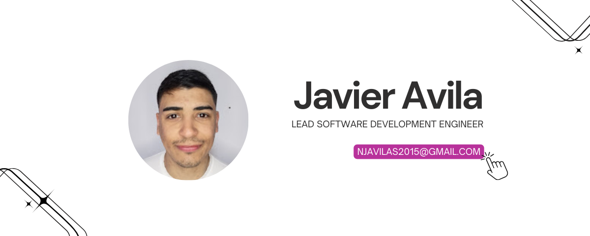
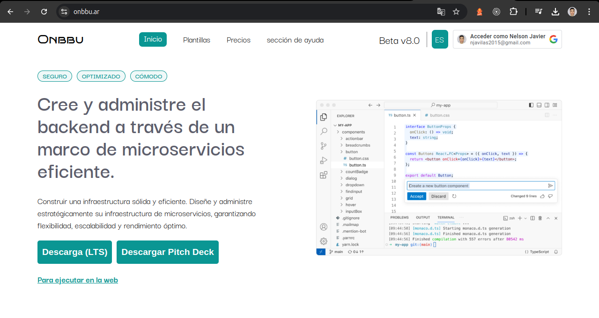
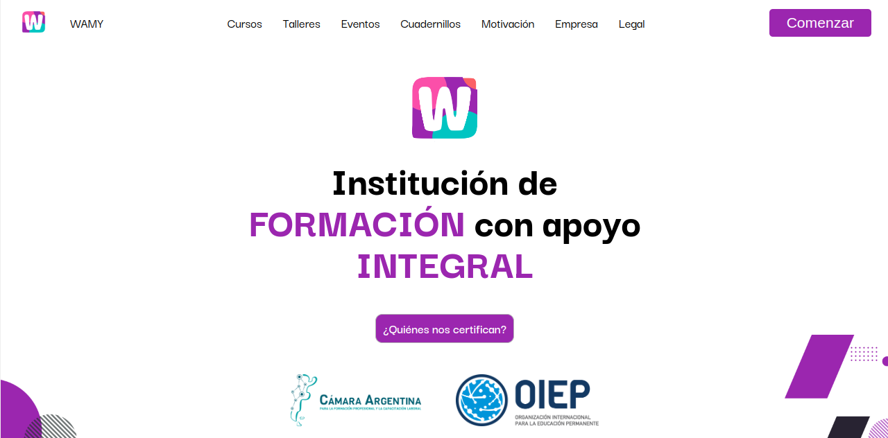

# 👋 ¡Hola, soy Javier Avila!

🎯 **Lead Software Development Engineer**

¡Bienvenido a mi perfil de GitHub! Disfruto aprender y experimentar con nuevas tecnologías, como lenguajes de programación y paradigmas innovadores. No me limito a lo conocido, sino que busco constantemente mejorar mis habilidades, Mi enfoque práctico y técnico es muy útil para resolver problemas. No solo me gusta explorar soluciones estándar, sino que me interesa buscar diferentes maneras eficientes y originales de abordar a los desafíos complejos, incluso a nivel de bajo nivel. creación de servicios cloud workers e interfaces gráficas para interactuar.

---

## 🚀 Acerca de mí

- 💻 **Lenguajes y Tecnologías**:  
  - **Frontend**: React, TypeScript, JavaScript, HTML5, CSS3
  - **Backend**: Node.js, Rust, Python, ASP.NET, Onbbu, GO
  - **Bases de Datos**: PostgreSQL, MySQL
  - **DevOps**: Docker, Nginx, CI/CD, Linux, Kubernetes
  - **Machine Learning**: TensorFlow, Keras, Scikit-learn

- 🌱 **Actualmente aprendiendo**: ASP.NET para microservicios

- 🧠 **Intereses**: 
  - Arquitectura de Microservicios
  - Optimización de sistemas distribuidos
  - Blockchain
  - Inteligencia Artificial

- 💼 **Proyectos actuales**:  
  - Desarrollo de una plataforma no-code en TypeScript.
  - Desarrollo de una plataforma para microservicios con arquitectura neuronal.

- 📫 **Contáctame**:  
  - Email: njavilas2015@gmail.com
  - LinkedIn: [linkedin.com/in/javieravilaredes](https://linkedin.com/in/javieravilaredes)

---

## 🌟 Proyectos Destacados

### [🔗 Onbbu](https://onbbu.ar)
#### Revolucionando el Desarrollo de Software

Onbbu es una plataforma innovadora que transforma el desarrollo de aplicaciones al integrar un enfoque basado en microservicios inspirado en la biología. A través del **Biological Service Model (BSM)**, Onbbu descompone las aplicaciones en componentes modulares, similares a neuronas, que se comunican entre sí mediante **Axons** y **Dendritas**. 

## ¿Qué hace a Onbbu único?

- **Arquitectura Biológica**: Su estructura imita el funcionamiento del sistema nervioso, mejorando la modularidad y flexibilidad del desarrollo.
- **Interacción Eficiente**: Facilita la comunicación síncrona y asíncrona entre microservicios, optimizando el rendimiento del sistema.
- **Escalabilidad y Reactividad**: Permite escalar y adaptar aplicaciones de manera rápida, respondiendo a cambios en tiempo real.

Onbbu no solo simplifica el desarrollo, sino que también brinda un marco conceptual claro para gestionar la complejidad en la era del software moderno.

### [🔗 Ikebu](https://ikebu.ar)
## App de Reciclaje y Compostaje

**App de Reciclaje y Compostaje** es una plataforma innovadora que ayuda a los usuarios a gestionar sus residuos de manera efectiva, promoviendo un estilo de vida más sostenible. 

- **Educación Interactiva**: Guías claras sobre reciclaje y compostaje que han incrementado la conciencia ambiental de los usuarios.

- **Sistema de Recompensas**: Incentivos mediante puntos y medallas

- **Calendario de Recogida Personalizado**: Recordatorios sobre las fechas de recolección de residuos.

- **Alianzas Estratégicas**: Colaboraciones con organizaciones ecológicas que ofrecen descuentos a nuestros usuarios.

- **Impacto Medible**: Contribución a la reducción de más de 500 toneladas de residuos desde el lanzamiento.

## Enfoque Futuro

Planeamos expandir nuestras funciones, incluyendo un sistema de geolocalización para puntos de reciclaje y un seguimiento de huella de carbono.

### [🔗 Wamy](https://wamy.ar)
#### Wamy Centro de Formación con Apoyo Integral

**Wamy** se destaca por ofrecer un enfoque integral de apoyo y formación que abarca tanto el desarrollo personal como profesional. Con un compromiso genuino hacia el bienestar, los servicios están diseñados para transformar positivamente a personas y organizaciones.

### ¿Qué hace a Wamy único?

- **Variedad de Servicios:** Desde consultoría en bienestar laboral hasta programas educativos personalizados.
- **Orientación Profesional:** Integramos psicología, habilidades blandas en todos nuestros programas.
- **Sectores Diversos:** Trabajamos con empresas, startups, instituciones académicas y organizaciones sin fines de lucro.
- **Innovación Continua:** Nos adaptamos a las últimas tendencias y necesidades, con un enfoque en la satisfacción del cliente.

### Relevancia

En Wamy, no solo obtienes formación, sino un aliado estratégico para alcanzar el éxito y el bienestar integral.

¡Gracias por visitar mi perfil! 🌟 No dudes en explorar mis repositorios y contribuir en lo que te interese.
